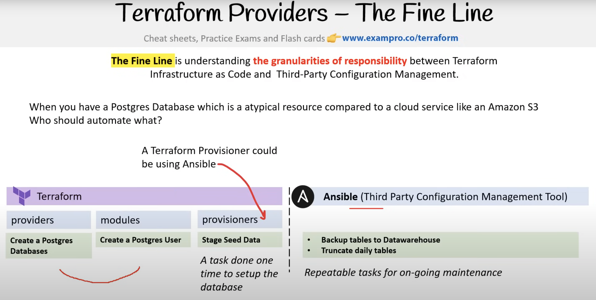
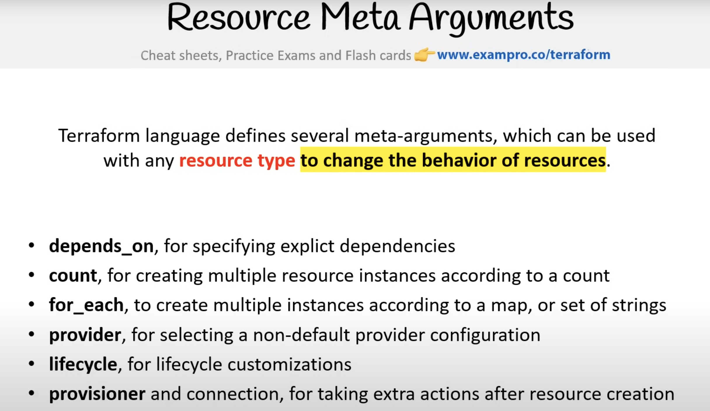

Taken from - https://www.youtube.com/watch?v=SPcwo0Gq9T8&ab_channel=freeCodeCamp.org
Free Practice Exams - https://exampro.co/terraform
Best Practices - www.terraform-best-practices.com

Passing grade is 700/1000 - Target as high as possible as this exam is not that difficult
Questions: 57 MCQ and some short answer
Time: 60 minutes
Valid for 24 months

# 0:00:00==Course Intro

# 0:15:03==Introduction

IaC: Blueprint for infrastructure -> Also good for collaboration, resuability, versioning
Terraform: Declarative+ (somewhere between declarative and imperative as there is some ways to put expressions (like Jinja2))
Infrastructure Lifecycle: Work phases for plan, design, test, maintain, retire cloud infrastructure

# 0:31:55==IaC Concepts

Day 0: Plan and Design
Day 1: Develop and Iterate
Day 2: Go live and Maintain

Day is just a seperate phase, not a literal 24-hour day

Idempotent: No matter how many times you run IaC, you will always end up with the same state that is expected

Configuration drift: Misconfiguration due to accidental changes, hacker attacks, API calls, etc.
Terraform solves this by using state files (to detect), or Terraform refresh and plan (to correct). Immutable infrastructure (always create and destroy, NEVER reuse, use of blue-green deployment. This is to prevent drift)

Immutable infrastructure: Configure first before deploy (by using a manifest like Ansible playbooks, Puppet manifests, etc)

GitOps: 
Immutable Infrastructure Guarantee: 

# 0:52:26==Hashicorp Introduction

# 0:56:33==Terraform Basics

Configuration file for Terraform: HashCorp Configuration Language (HCLt)

Terraform Lifecycle 

Visualizing Execution Plans: 

Terraform can also be used for Multi-Cloud Deployment.

# 1:07:37==Terraform Provisioners

Provisioner: Preparing resources
Local-exec: 
Remote-exec: 
File: 
Connection: 
Null Resources: 
Terraform Data: 

# 1:20:19==Terraform Providers

Terraform Registry: 
Terraform Providers vs Modules: 
Terraform vs Ansible, The Fine line: 

# 1:30:35==Terraform Language

HashiCorp Configuration Language (HCL): 
Terraform Settings: 

# 1:35:23==Variables and Data

Input Variables: 
Variable Definitions Files: 
!IMPORTANT Environment Variables: 
Loading Input Variables: 
Variable Precendence:  (in short env vars are loaded first, -var or -var-file flag is loaded last, hence the latter will overwrite everything else)

Output Values:  and 
Local Values:  and 
Data Sources: 
!IMPORTANT References to Named Values: 

# 1:47:52==Meta Arguments

Resource Meta Arguments: 
Resource Behavior: 
Lifecycle: 
Alias: 

# 1:54:40==Expressions

# 2:41:01==Terraform State

# 2:45:42==Initialization

# 2:48:09==Writing and Modifying

# 2:51:17==Plan and Apply

# 2:54:23==Drift

# 3:01:24==Troubleshooting

# 3:05:55==Terraform Modules

# 3:11:25==Terraform Workflows

# 3:18:28==Terraform Backends

# 3:37:22==Resources and Complex Types

# 3:48:10==Built in Functions

# 4:18:30==Terraform Cloud

# 4:42:10==Terraform Enterprise

# 4:51:47==Workspaces

# 5:07:53==Sentinel and Terraform

# 5:54:42==Packer

# 6:22:04==Consul

# 6:23:13==Vault

# 6:56:06==Miscellaneous
